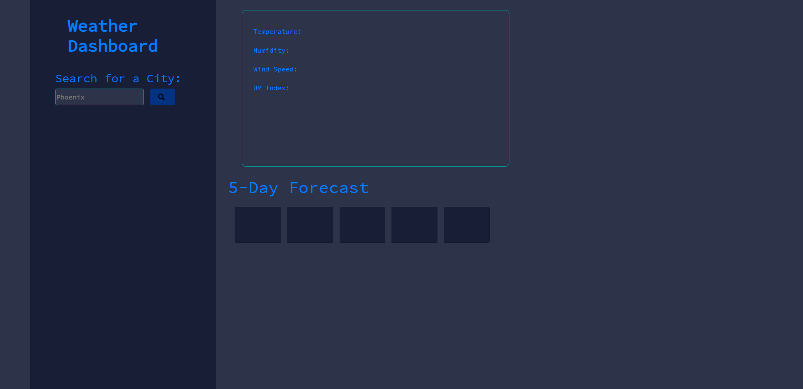
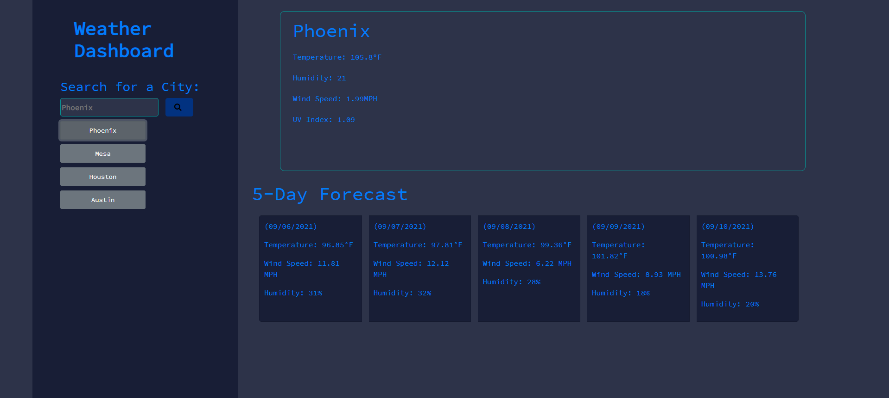

# Weather Dashboard
## Table of Contents:
  * [Description](#description)
  * [Screenshots](#screenshots)
  * [How to install](#installation)
  * [Technologies Used](#technologies)
## Description

As a traveler, I want to see the weather outlook for multiple cities so that I can plan a trip accordingly

## Screenshots

## Installation

Click [here](https://github.com/BA1bers/weather-dashboard.git) for the link to my github repository

My Weather Dashboard is published [here](https://ba1bers.github.io/weather-dashboard/)

## Technologies Used
    Javascript
    HTML
    CSS
    Jquery
    Open Weather API
    Cloudflare

## Made by:

Brent Albers

## Email
Have any questions? feel free to email me at brent.albers@yahoo.com. 

## GitHub
Follow me on github where you can also ask me questions here at https://github.com/BA1bers.