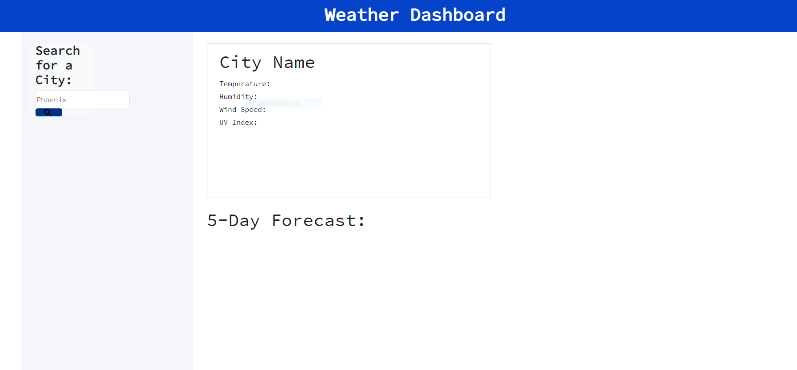

# Weather Dashboard

## Purpose

As a traveler, I want to see the weather outlook for multiple cities so that I can plan a trip accordingly

## Installation

[The link to my github repo is here:](https://github.com/BA1bers/weather-dashboard.git)

[Weather Dashboard is published here:](https://ba1bers.github.io/weather-dashboard/)

## Screenshots

## Built with
    * Javascript
    * HTML
    * CSS
    * Jquery
    * Open Weather API
    * Cloudflare

## Made by:

Brent Albers